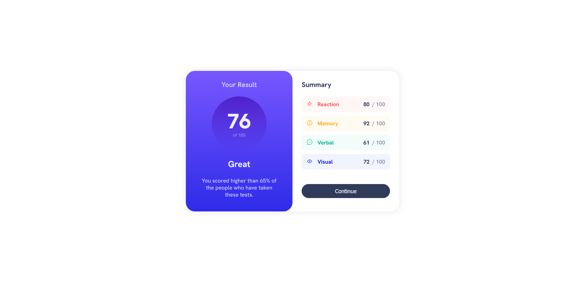
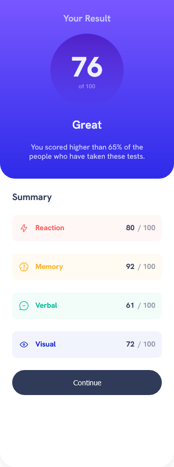

# Frontend Mentor - Results summary component solution

This is a solution to the [Results summary component challenge on Frontend Mentor](https://www.frontendmentor.io/challenges/results-summary-component-CE_K6s0maV). Frontend Mentor challenges help you improve your coding skills by building realistic projects.

## Table of contents

- [Overview](#overview)
  - [The challenge](#the-challenge)
  - [Screenshot](#screenshot)
  - [Links](#links)
- [My process](#my-process)
  - [Built with](#built-with)
  - [What I learned](#what-i-learned)
- [Author](#author)

## Overview

### The challenge

Users should be able to:

- View the optimal layout for the interface depending on their device's screen size
- See hover and focus states for all interactive elements on the page
- **Bonus**: Use the local JSON data to dynamically populate the content

### Screenshot

### Links

- Solution URL: [github](https://github.com/mihai2537/Results-summary-component)
- Live Site URL: [live website](https://mihai2537.github.io/Results-summary-component/)

## My process

### Built with

- Semantic HTML5 markup
- CSS custom properties
- Flexbox
- Desktop-first approach

### What I learned

- You cannot add a transition directly to a background image. In our scenario this was the gradient used on the button.
- Sometimes it is a good idea to decrease the opacity of the background color, you could get nice effects.

## Author

- Website - [live-website](https://mihai2537.github.io/Results-summary-component/)
- Frontend Mentor - [@mihai2537](https://www.frontendmentor.io/profile/mihai2537)
